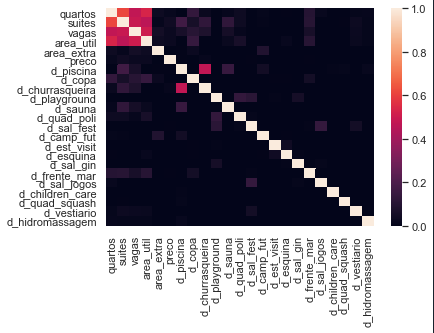
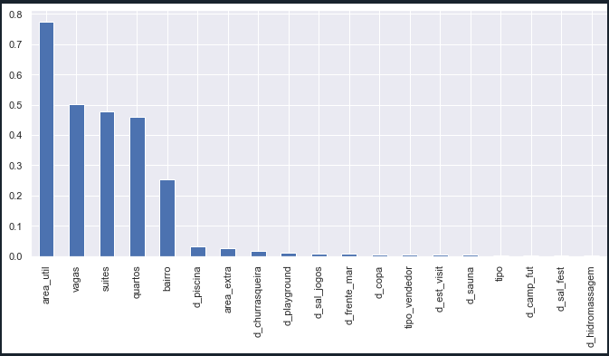
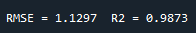

# 1. Introdução
Trabalho 2 de Introdução ao Aprendizado de Máquina. Tem por objetivo a criação de um modelo de regressão para estimar o preço de um imóvel a partir de suas características.

# 2. Pré-processamento

O objetivo dessa etapa foi transformar os dados brutos em um conjunto utilizável pelo sistema de treinamento. Como os dados brutos não estavam necessitando de muitos reparos, o trabalho maior foi em realizar uma etapa específica. 

Esta etapa configurou-se em conseguir aplicar um ONE-HOTING ENCODER em dados misturados dentro de uma única coluna (*diferenciais*). Para isso, foram criadas duas colunas como sendo o diferencial 1 e o diferencial 2 para dividir inicialmente as informações. Após, foram criadas colunas pra cada opção previamente elencadas, em que se houvesse a incidência em alguma daquelas 2 colunas iniciais, era adicionado 1, caso contrário, era inserido 0.

**Obs**.: Também foi testada a função *get_dummies* do pandas, porém, como houve um resultado melhor com o sistema categórico, este mais tradicional foi descartado.  

# 3. Seleção de atributos

Houve uma redundância de parâmetros entre a coluna *diferenciais* e as colunas "binarizadas" que incluiam alguns diferenciais sobre o imóvel. No entanto, como essa primeira coluna possuia mais informações, foi optado remover as demais colunas e realizando o ONE-HOTING ENCODER manual como supracitado.

Continuando em termos de correlação aos parâmetros e visando diminuir mais a redundância, foi criada a função *show_correlation_matrix* que utiliza a biblioteca **seaborn** para plotar um gráfico com uma escala de cor da correlação cruzada entre os parâmetros. 

Figura 1 - Matriz de correlação entre os parâmetros

Essa função acabou não fazendo muita diferença porque o sistema possui poucas dimensões e mesmo possuindo uma certa relação alta entre o parâmetro *quartos* e *suites*, seria prejudicial remover algum deles unicamente pela correlação.

Deste modo, foi implementado um trecho de código na função *main* que utililiza a biblioteca **mutual_info_regression** de **feature_selection** presente no **sklearn**, a qual tem por objetivo listar um índice de impacto dos parâmetros com o resultado. 

Figura 2 - Gráfico de impacto de cada parâmetro no target de preço

Dessa forma, foi feito uma lista com os parâmetros organizados do mais impactantes aos menos. Por fim, os parâmetros que possuiam um impacto maior do que zero não foram removidos dos dados de treinamento do modelo. 

# 4. Implementação
## 4.1. Escolha do modelo preditivo
Como é possível ver no código foram testados 13 **regressores**: *KNN Regressor*, *Random Forest Regressor*, *Linear Regresssion*, *LogisticRegression*, *Lasso*, *Ridge*, *SGD*, *SVR linear*, *SVR poly*, *SVR RBF*, *Grid Search CV*, *Gradient Boosting Regressor*, e o *Ada Boost Regressor*, que aprensetou o melhor resultado.

Para achar o modelo ideal foi na base do teste sequencial. Para cada parâmetro, era visto o desempenho até obter o que apresentava o melhor resultado sem nenhuma otimização inicial.

## 4.2. Script
A modularização tanto das funcionalidades em pequenos blocos, nas condições de treinamento criadas (*validação*: treinamento sem gerar o output do teste; *validação cruzada*: utilizada para alterar os hiperparâmetros; *oficial*: após a definição dos siperparâmetros, gera o output de teste) e nos comentários, facilitando a contextualização, auxiliaram no desenvolvimento otimizado do código. Por certo costume de executar o código completo e também por não consumir tanto tempo, foi escolhido esse método ao invés de explorar as possibilidades de reservar parte do código pré-executada que o console do Spyder oferece.

A lógica de funcionamento geral passou pelas seguintes etapas:

* Recebimento dos dados brutos de input: *get_data*.
* Primeira remoção de parâmetros inúteis: *filter_best_params*
* Pré-processamento (como já explicado acima): *preprocessing*.
* Adição das colunas que o ONE-HOTING ENCODER gerou no teste e não no treino, e vice-versa, para que o modelo possua as mesmas dimensões: *add_difference_param_train_test*. 
* Mover o target para a última coluna, organizando todos inicialmente em ordem alfabética: função (*reindex*) e *move_overdue_to_end*.
* Divisão de inputs em outputs, junção dos dados de teste com o treino e a realização da padronização da escala.
* Split do treino com o teste, além do treino ser dividido em parte de treino com parte de teste.
* Obtenção do impacto de cada parâmetro com o target, filtrando somente os que possuem uma mínima influência.
* Dependendo da opção de trainamento, o código pode seguir 3 caminhos diferentes como já explicado acima (trainamento de *validação*, *validação cruzada* e *oficial*), no entanto, todos possuem um sistema de ao final, mostrar o resultado obtido localmente.

## 4.3. Ajustes e hiperparâmetros

Como os modelos executavam bem rapidamente (provavelmente por possuir poucas dimensões), foi utilizado o modo de *treinamento oficial* para obtenção dos melhores hiperparâmetros.

No caso do regressor com melhor desempenho (Ada Boost Regressor), os hiperparâmetro utilizado foram *n_estimators*, *learning_rate* e *loss*. Realmente pôde ser visto que havia uma cruva de melhora e após os resultados começavam a piorar, portanto, os valores obtidos servem como otimizados para este modelo.

Deste modo, os hiperparâmetros obtidos foram: 

* **n_estimators=65**
* **learning_rate=0.75**
* **loss='exponential'**

# 5. Análise geral do desempenho

Por fim, executando todo o desenvolvido acima, foi possível obter a seguinte resposta do código:

Figura 3 - Resultado do melhor modelo obtido localmente

É possível notar que o modelo estava relativamente bem treinado, obtendo 1.1297 de RMSE e com um R2 de 0.99 praticamente, ambos comparados com os dados de treino. Já com o resultado final de teste (obtido como resposta do Kaggle), o modelo apresentou um resultado melhor ainda, chegando em  um **RMSE de 0.48209**.